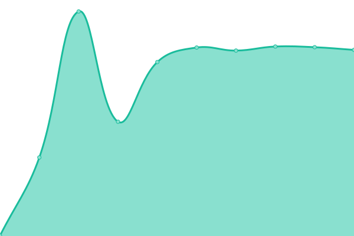
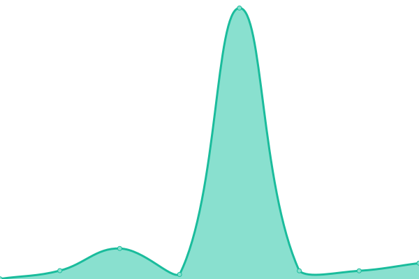
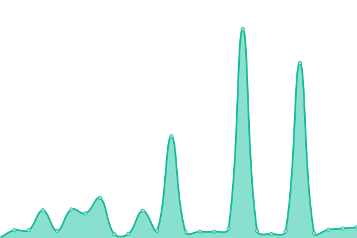

# [📈 Live Status](https://demo.upptime.js.org): <!--live status--> **🟧 Partial outage**

This repository contains the open-source uptime monitor and status page for [Upptime](https://upptime.js.org), powered by [Upptime](https://github.com/upptime/upptime).

With [Upptime](https://upptime.js.org), you can get your own unlimited and free uptime monitor and status page, powered entirely by a GitHub repository. We use [Issues](https://github.com/upptime/upptime/issues) as incident reports, [Actions](https://github.com/xiaotiandada/upptime/actions) as uptime monitors, and [Pages](https://demo.upptime.js.org) for the status page.

<!--start: status pages-->
<!-- This summary is generated by Upptime (https://github.com/upptime/upptime) -->
<!-- Do not edit this manually, your changes will be overwritten -->
<!-- prettier-ignore -->
| URL | Status | History | Response Time | Uptime |
| --- | ------ | ------- | ------------- | ------ |
|  [API Governance](https://governance.matataki.io/api/logs) | 🟥 Down | [api-governance.yml](https://github.com/Meta-Network/upptime/commits/HEAD/history/api-governance.yml) | 

 1049ms
     
 | 

<a href="https://Meta-Network.github.io/upptime/history/api-governance">100.00%</a>
    

|  [API management](https://api-mgr-hk.mttk.net) | 🟥 Down | [api-management.yml](https://github.com/Meta-Network/upptime/commits/HEAD/history/api-management.yml) | 

 914ms
     
 | 

<a href="https://Meta-Network.github.io/upptime/history/api-management">95.31%</a>
    

|  [API Meta Network](https://network.api.metanetwork.online) | 🟩 Up | [api-meta-network.yml](https://github.com/Meta-Network/upptime/commits/HEAD/history/api-meta-network.yml) | 

 452ms
     
 | 

<a href="https://Meta-Network.github.io/upptime/history/api-meta-network">99.79%</a>
    

|  [API MTTK](https://api.mttk.net) | 🟥 Down | [api-mttk.yml](https://github.com/Meta-Network/upptime/commits/HEAD/history/api-mttk.yml) | 

 802ms
     
 | 

<a href="https://Meta-Network.github.io/upptime/history/api-mttk">89.85%</a>
    

|  [API MTTK auth-be](http://auth-be.mttk.net) | 🟩 Up | [api-mttk-auth-be.yml](https://github.com/Meta-Network/upptime/commits/HEAD/history/api-mttk-auth-be.yml) | 

 135ms
     
 | 

<a href="https://Meta-Network.github.io/upptime/history/api-mttk-auth-be">100.00%</a>
    

|  [API MTTK cache-ore](http://cache-ore.mttk.net) | 🟩 Up | [api-mttk-cache-ore.yml](https://github.com/Meta-Network/upptime/commits/HEAD/history/api-mttk-cache-ore.yml) | 

 123ms
     
 | 

<a href="https://Meta-Network.github.io/upptime/history/api-mttk-cache-ore">100.00%</a>
    

|  [API MTTK cache-ore subscriptions](https://cache-ore.mttk.net/matataki/status/subscriptions) | 🟥 Down | [api-mttk-cache-ore-subscriptions.yml](https://github.com/Meta-Network/upptime/commits/HEAD/history/api-mttk-cache-ore-subscriptions.yml) | 

 167ms
     
 | 

<a href="https://Meta-Network.github.io/upptime/history/api-mttk-cache-ore-subscriptions">100.00%</a>
    

|  [API MTTK IPFS](https://api.mttk.net/post/ipfs/QmSr94SdMEdCgGTKyJYTwMdVEzZ28sRiLqfQ7S7c2t8C5h) | 🟥 Down | [api-mttk-ipfs.yml](https://github.com/Meta-Network/upptime/commits/HEAD/history/api-mttk-ipfs.yml) | 

 470ms
     
 | 

<a href="https://Meta-Network.github.io/upptime/history/api-mttk-ipfs">90.32%</a>
    

|  [API MTTK Token](https://api.mttk.net/minetoken/238) | 🟥 Down | [api-mttk-token.yml](https://github.com/Meta-Network/upptime/commits/HEAD/history/api-mttk-token.yml) | 

 921ms
     
 | 

<a href="https://Meta-Network.github.io/upptime/history/api-mttk-token">91.43%</a>
    

|  [API Quest](https://misson-hall-api.mttk.net) | 🟥 Down | [api-quest.yml](https://github.com/Meta-Network/upptime/commits/HEAD/history/api-quest.yml) | 

 412ms
     
 | 

<a href="https://Meta-Network.github.io/upptime/history/api-quest">100.00%</a>
    

|  [Cryptomeetup](https://cryptomeetup.async.moe) | 🟥 Down | [cryptomeetup.yml](https://github.com/Meta-Network/upptime/commits/HEAD/history/cryptomeetup.yml) | 

 0ms
     
 | 

<a href="https://Meta-Network.github.io/upptime/history/cryptomeetup">100.00%</a>
    

|  [Hero](https://dao-hero.netlify.app) | 🟩 Up | [hero.yml](https://github.com/Meta-Network/upptime/commits/HEAD/history/hero.yml) | 

 209ms
     
 | 

<a href="https://Meta-Network.github.io/upptime/history/hero">99.80%</a>
    

|  [management](https://mgr-prod.mttk.net) | 🟥 Down | [management.yml](https://github.com/Meta-Network/upptime/commits/HEAD/history/management.yml) | 

 895ms
     
 | 

<a href="https://Meta-Network.github.io/upptime/history/management">95.33%</a>
    

|  [Matataki Airdrop](https://www.matataki-airdrop.xyz) | 🟩 Up | [matataki-airdrop.yml](https://github.com/Meta-Network/upptime/commits/HEAD/history/matataki-airdrop.yml) | 

 625ms
     
 | 

<a href="https://Meta-Network.github.io/upptime/history/matataki-airdrop">100.00%</a>
    

|  [Matataki DAO](https://matataki-dao.netlify.app) | 🟩 Up | [matataki-dao.yml](https://github.com/Meta-Network/upptime/commits/HEAD/history/matataki-dao.yml) | 

 111ms
     
 | 

<a href="https://Meta-Network.github.io/upptime/history/matataki-dao">99.81%</a>
    

|  [Matataki developer](https://developer.matataki.io) | 🟩 Up | [matataki-developer.yml](https://github.com/Meta-Network/upptime/commits/HEAD/history/matataki-developer.yml) | 

 197ms
     
 | 

<a href="https://Meta-Network.github.io/upptime/history/matataki-developer">100.00%</a>
    

|  [Matataki Doc](https://docs.matataki.io) | 🟩 Up | [matataki-doc.yml](https://github.com/Meta-Network/upptime/commits/HEAD/history/matataki-doc.yml) | 

 579ms
     
 | 

<a href="https://Meta-Network.github.io/upptime/history/matataki-doc">100.00%</a>
    

|  [Matataki FE Article](https://www.matataki.io/article) | 🟥 Down | [matataki-fe-article.yml](https://github.com/Meta-Network/upptime/commits/HEAD/history/matataki-fe-article.yml) | 

 7086ms
     
 | 

<a href="https://Meta-Network.github.io/upptime/history/matataki-fe-article">77.99%</a>
    

|  [Matataki FE P](https://www.matataki.io/p/9730) | 🟥 Down | [matataki-fe-p.yml](https://github.com/Meta-Network/upptime/commits/HEAD/history/matataki-fe-p.yml) | 

 1025ms
     
 | 

<a href="https://Meta-Network.github.io/upptime/history/matataki-fe-p">83.70%</a>
    

|  [Matataki FE Token](https://www.matataki.io/token/238) | 🟥 Down | [matataki-fe-token.yml](https://github.com/Meta-Network/upptime/commits/HEAD/history/matataki-fe-token.yml) | 

 1147ms
     
 | 

<a href="https://Meta-Network.github.io/upptime/history/matataki-fe-token">86.39%</a>
    

|  [Matataki Governace](https://governance.matataki.io) | 🟥 Down | [matataki-governace.yml](https://github.com/Meta-Network/upptime/commits/HEAD/history/matataki-governace.yml) | 

 908ms
     
 | 

<a href="https://Meta-Network.github.io/upptime/history/matataki-governace">66.65%</a>
    

|  [Matataki mining](https://matataki-mining.netlify.app) | 🟩 Up | [matataki-mining.yml](https://github.com/Meta-Network/upptime/commits/HEAD/history/matataki-mining.yml) | 

 284ms
     
 | 

<a href="https://Meta-Network.github.io/upptime/history/matataki-mining">99.81%</a>
    

|  [Matataki NFT Market](https://nft-market.matataki.io) | 🟩 Up | [matataki-nft-market.yml](https://github.com/Meta-Network/upptime/commits/HEAD/history/matataki-nft-market.yml) | 

 116ms
     
 | 

<a href="https://Meta-Network.github.io/upptime/history/matataki-nft-market">100.00%</a>
    

|  [Matataki Quest](https://quest.matataki.io) | 🟥 Down | [matataki-quest.yml](https://github.com/Meta-Network/upptime/commits/HEAD/history/matataki-quest.yml) | 

 1007ms
     
 | 

<a href="https://Meta-Network.github.io/upptime/history/matataki-quest">43.35%</a>
    

|  [MatatakiMD](https://md.mttk.net) | 🟥 Down | [matataki-md.yml](https://github.com/Meta-Network/upptime/commits/HEAD/history/matataki-md.yml) | 

 0ms
     
 | 

<a href="https://Meta-Network.github.io/upptime/history/matataki-md">100.00%</a>
    

|  [Metanetowrk Map](https://www.metanetwork.online) | 🟩 Up | [metanetowrk-map.yml](https://github.com/Meta-Network/upptime/commits/HEAD/history/metanetowrk-map.yml) | 

 89ms
     
 | 

<a href="https://Meta-Network.github.io/upptime/history/metanetowrk-map">100.00%</a>
    

|  [MetaNetwork Home](https://home.metanetwork.online) | 🟩 Up | [meta-network-home.yml](https://github.com/Meta-Network/upptime/commits/HEAD/history/meta-network-home.yml) | 

 272ms
     
 | 

<a href="https://Meta-Network.github.io/upptime/history/meta-network-home">100.00%</a>
    

|  [OSS aliyuncs cn hongkong](https://smartsignature-img.oss-cn-hongkong.aliyuncs.com/avatar/2020/01/27/4ea1a68f7445d49f4cc36df476be2a09.jpg) | 🟩 Up | [oss-aliyuncs-cn-hongkong.yml](https://github.com/Meta-Network/upptime/commits/HEAD/history/oss-aliyuncs-cn-hongkong.yml) | 

 1023ms
     
 | 

<a href="https://Meta-Network.github.io/upptime/history/oss-aliyuncs-cn-hongkong">100.00%</a>
    

|  [Test Bot](https://cstate-one.vercel.app) | 🟩 Up | [test-bot.yml](https://github.com/Meta-Network/upptime/commits/HEAD/history/test-bot.yml) | 

 101ms
     
 | 

<a href="https://Meta-Network.github.io/upptime/history/test-bot">100.00%</a>
    

<!--end: status pages-->

[**Visit our status website →**](https://demo.upptime.js.org)

## 📄 License

- Powered by: [Upptime](https://github.com/upptime/upptime)
- Code: [MIT](./LICENSE) © [Upptime](https://upptime.js.org)
- Data in the `./history` directory: [Open Database License](https://opendatacommons.org/licenses/odbl/1-0/)
